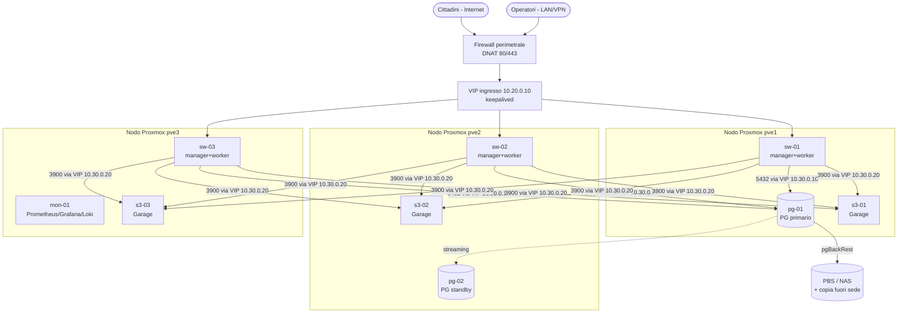

# Deploy in produzione su Proxmox VE

Guida di architettura e di esercizio per Città Semplice (portal, office, job
schedulati) su un cluster Proxmox VE on-premise.

I file di configurazione citati sono in [`infra/produzione/`](../infra/produzione/).
Gli indirizzi IP, i nomi host e le dimensioni sono **esempi coerenti tra loro**:
vanno adattati al piano di indirizzamento dell'ente, cambiandoli ovunque
compaiono.

---

## Indice

1. [Decisioni in sintesi](#1-decisioni-in-sintesi)
2. [Prerequisiti bloccanti](#2-prerequisiti-bloccanti)
3. [Architettura](#3-architettura)
4. [Perché Docker Swarm](#4-perché-docker-swarm)
5. [Proxmox: cluster, rete, storage, VM](#5-proxmox-cluster-rete-storage-vm)
6. [Database: PostgreSQL 17](#6-database-postgresql-17)
7. [Object storage: Garage](#7-object-storage-garage)
8. [Cluster applicativo: Docker Swarm](#8-cluster-applicativo-docker-swarm)
9. [Immagini e CI](#9-immagini-e-ci)
10. [Primo deploy](#10-primo-deploy)
11. [Esercizio quotidiano](#11-esercizio-quotidiano)
12. [Monitoraggio e allarmi](#12-monitoraggio-e-allarmi)
13. [Backup e ripristino](#13-backup-e-ripristino)
14. [Risoluzione problemi](#14-risoluzione-problemi)
15. [Checklist di go-live](#15-checklist-di-go-live)
16. [Appendice A — Collaudo locale dello stack](#appendice-a--collaudo-locale-dello-stack)

---

## 1. Decisioni in sintesi

| Tema | Scelta | Motivo |
|---|---|---|
| Orchestratore | **Docker Swarm** (3 manager, anche worker) | Le app sono già containerizzate e senza stato (sessioni JWT, allegati su S3). Swarm dà rolling update, rollback automatico, segreti e overlay con un file che è quasi il `docker-compose.yml` di sviluppo. Nessun control plane aggiuntivo da mantenere. |
| Ingresso | **Traefik v3** globale sui nodi swarm + **VIP keepalived** | TLS, routing per host, readiness su `/api/ready`, allowlist per l'office. Il VIP sposta l'ingresso se un nodo cade. |
| Database | **PostgreSQL 17 su VM dedicate**: primario + standby in streaming, **pgBackRest** con PITR | Fuori dallo swarm: stato critico, prestazioni disco, backup e failover con strumenti nativi. |
| Allegati | **Garage** a 3 nodi, `replication_factor = 3`, una zona per nodo Proxmox | Già usato in sviluppo (stesso codice, `STORAGE_DRIVER=s3`); regge la perdita di un nodo intero. |
| Ridondanza | **A livello applicativo, non di hypervisor** | Swarm, replica Postgres e Garage replicano già da soli: storage locale ZFS su ogni nodo, niente Ceph, niente HA Proxmox per queste VM. |
| Job schedulati | Servizio `cron` (supercronic) con **una** replica | Nessun timer dentro le app: con N repliche girerebbe N volte. |
| Segreti | **Docker secrets** → variabili d'ambiente tramite l'entrypoint dell'immagine | Nessuna password in file di configurazione, variabili di stack o history. |
| Registry | **GHCR** (privato), immagini costruite da GitHub Actions ai tag `v*` | Il repository è già su GitHub. Deploy avviato a mano dal nodo manager. |

---

## 2. Prerequisiti bloccanti

Da risolvere **prima** del go-live; nessuno si aggira con la configurazione.

Stato al 15/09/2026:

| # | Prerequisito | Stato |
|---|---|---|
| 1 | Migrazione di base `0_init` | ✅ Fatto e collaudato, GO-LIVE.md allineato |
| 2 | Credenziali fuori dal repository | ✅ Fatto nel compose. La password vecchia resta nella history di git |
| 3 | Certificato TLS dell'ente | ⏳ Da fare |
| 4 | Uscite verso internet autorizzate | ⏳ Da fare |
| 5 | Postgres di sviluppo alla major 17 | ✅ Fatto |
| 6 | Host dedicati, niente `basePath` | ℹ️ Vincolo di progetto |

1. **Migrazione di base — fatto.**
   `packages/db/prisma/migrations/0_init/migration.sql` contiene lo schema
   Prisma più gli oggetti che il DSL non esprime (pg_trgm, funzioni, trigger,
   indici GIN), presi da `prisma/sql/oggetti-database.sql`. È stata collaudata
   (§A) con l'immagine `citta-migrator` su PostgreSQL 17 vuoto, applicandola
   come `citta_owner` non superuser secondo §6.2.

   Ancora da fare:
   - **`migration_lock.toml`** manca. `migrate deploy` funziona anche senza
     (verificato), ma `prisma migrate dev` lo ricrea: va messo sotto git
     insieme alla prima migrazione successiva.
   - D'ora in poi le modifiche allo schema si fanno solo con
     `prisma migrate dev`, mai con `db push`: altrimenti produzione e
     sviluppo divergono di nuovo.
   - `oggetti-database.sql` resta la fonte per il seed del compose. Se lo si
     modifica, la stessa modifica va portata in una **nuova** migrazione:
     `0_init` non si tocca più, una volta applicata da qualche parte.

2. **Credenziali di sviluppo — fatto nel compose.** `docker-compose.yml`
   legge `POSTGRES_USER`, `POSTGRES_PASSWORD` e `POSTGRES_DB` dal `.env` della
   radice, e compone da lì anche `DATABASE_URL` e il controllo di salute. Se
   manca la password, il compose si ferma con un messaggio chiaro. La password
   di prima però è ancora **nella history di git**: non va riusata in
   produzione, e se è stata usata altrove va cambiata anche lì.

3. **Certificato TLS** per `PORTAL_HOST` e `OFFICE_HOST` (wildcard o SAN),
   emesso dalla CA che usa l'ente. Traefik gira su più nodi e la versione open
   source non condivide lo stato ACME: in questa topologia Let's Encrypt
   automatico non si può usare.

4. **Uscite verso internet autorizzate** dalla VLAN applicativa verso: Urbi
   SMART, PMPay (`secure.pmpay.it`), SSO dell'ente (`CIG_SSO_URL`), server SMTP
   configurato nell'office, `ghcr.io` (o un mirror del registry).

5. **Postgres di sviluppo alla 17 — fatto.** `docker-compose.yml` usa
   `postgres:17-alpine`, la stessa major della produzione. Nel compose il
   database si chiama `citta_semplice` (`POSTGRES_DB`), in produzione `io_db`
   (§6.2): è solo un nome, basta che coincida con `DATABASE_URL`.

6. **Host dedicati, niente `basePath`.** `NEXT_PUBLIC_BASE_PATH` viene
   incorporato al momento del build e il Dockerfile non lo passa. Questa
   guida assume un host per app (`istanze.…`, `office.…`). Se servisse un
   sotto-percorso, va passato come `--build-arg`.

---

## 3. Architettura

### 3.1 Topologia



Dentro lo swarm (stack `citta`, file `infra/produzione/stack.yml`):

| Servizio | Repliche | Reti overlay | Ruolo |
|---|---|---|---|
| `traefik` | globale sui nodi `edge=true` | `pubblico`, `socket` | TLS, routing, readiness, allowlist office, blocco `/api/cron` |
| `socket-proxy` | globale sui manager | `socket` (interna) | API Docker in sola lettura per Traefik |
| `portal` | 3 (6 nei click day) | `pubblico` | Portale cittadini |
| `office` | 2 | `pubblico`, `interno` | Back-office operatori + endpoint `/api/cron/*` |
| `cron` | 1 | `interno` | Chiama i job dell'office |

### 3.2 Flussi

| Da | A | Porta | Note |
|---|---|---|---|
| Internet / LAN | VIP 10.20.0.10 | 80, 443 | 80 → redirect 443 |
| Traefik | portal/office (IP dei task) | 3000 | Health check `/api/ready` ogni 10 s |
| cron | `office:3000` (VIP swarm) | 3000 | Header `x-cron-secret`, non passa da Traefik |
| portal, office | VIP Postgres 10.30.0.10 | 5432 | Utente `citta_app_vN` |
| portal, office | VIP Garage 10.30.0.20 | 3900 | Bucket `citta-allegati` |
| portal, office | Internet | 443 / SMTP | Urbi, PMPay, SSO, SMTP |
| pg-01 | pg-02 | 5432 | Replica in streaming |
| s3-0x | s3-0x | 3901 | RPC Garage |
| mon-01 | tutte le VM | 9100, 9323, 8082, 3903, 9187 | Metriche |

### 3.3 Liveness e readiness

Le app espongono due endpoint distinti e la topologia li usa entrambi:

- **`/api/health`** (non tocca il database) → `HEALTHCHECK` dell'immagine →
  Swarm riavvia il task se fallisce 3 volte. Un database lento **non** fa
  riavviare a cascata le repliche.
- **`/api/ready`** (`SELECT 1`) → health check di Traefik → la replica esce
  dal bilanciamento senza essere riavviata e rientra da sola.

Se il database cade, **tutte** le repliche escono dal bilanciamento e Traefik
risponde `503 no available server` su ogni percorso, anche `/api/health`. È il
comportamento voluto: nessun riavvio a cascata, e il servizio torna da solo
quando torna il database (verificato, §A). Un controllo esterno su
`/api/health` segnala quindi anche i guasti del database; per distinguere le
due cause si guarda l'health check dei task (`docker service ps`).

### 3.4 Piano delle VM

| VM | Nodo | VLAN | IP | vCPU | RAM | Dischi | Note |
|---|---|---|---|---|---|---|---|
| sw-01 | pve1 | 20 APP | 10.20.0.11 | 4 | 12 GB | 60 GB | manager, `zona=pve1`, `edge=true` |
| sw-02 | pve2 | 20 APP | 10.20.0.12 | 4 | 12 GB | 60 GB | manager, `zona=pve2`, `edge=true` |
| sw-03 | pve3 | 20 APP | 10.20.0.13 | 4 | 12 GB | 60 GB | manager, `zona=pve3`, `edge=true` |
| pg-01 | pve1 | 30 DATI | 10.30.0.11 (+VIP .10) | 8 | 32 GB | 40 GB OS + 250 GB NVMe dati | primario |
| pg-02 | pve2 | 30 DATI | 10.30.0.12 | 8 | 32 GB | 40 GB OS + 250 GB NVMe dati | standby |
| s3-01 | pve1 | 30 DATI | 10.30.0.21 | 2 | 4 GB | 20 GB OS + 20 GB SSD meta + dati | |
| s3-02 | pve2 | 30 DATI | 10.30.0.22 | 2 | 4 GB | idem | |
| s3-03 | pve3 | 30 DATI | 10.30.0.23 | 2 | 4 GB | idem | |
| mon-01 | pve3 | 10 MGMT | 10.10.0.50 | 4 | 8 GB | 200 GB | Prometheus, Grafana, Loki, Alertmanager |

VIP: ingresso **10.20.0.10**, Postgres **10.30.0.10**, S3 **10.30.0.20**.

Dimensionamento del disco dati Garage: volume allegati attuale × 1,5 di
crescita annua × anni di conservazione. Con `replication_factor = 3` ogni nodo
contiene una copia intera.

Budget connessioni Postgres: `(PORTAL_REPLICHE + OFFICE_REPLICHE + 2) ×
DATABASE_POOL_MAX` deve restare sotto `max_connections − 20`. Con 3+2 repliche
e pool 10: 70 connessioni; con 6 repliche di portal nel click day: 100. Il
`+2` copre le repliche in più durante un rolling update `start-first`.

---

## 4. Perché Docker Swarm

| | Docker Swarm | K3s (Kubernetes) | Nomad |
|---|---|---|---|
| Distanza dal setup attuale | Minima: stesso formato compose | Riscrittura in manifest/Helm | Riscrittura in HCL |
| Componenti da gestire | Solo Docker Engine | Control plane, etcd/sqlite, CNI, ingress controller, cert-manager | Nomad + Consul (+ Vault) |
| Competenze richieste | Docker | Kubernetes | HashiCorp stack |
| Rolling update + rollback automatico | Sì | Sì | Sì |
| Segreti | Sì (cifrati nel Raft) | Sì (da cifrare a parte) | Con Vault |
| Autoscaling, CronJob, GitOps | No (cron come servizio, scale manuale) | Sì | Parziale |

**Raccomandazione: Swarm.** Il carico è di due app web senza stato più un
cron: le funzioni di Kubernetes che mancano a Swarm (autoscaling, operatori,
GitOps) non servono qui e il loro costo operativo ricadrebbe su un team
piccolo.

**Quando passare a K3s:** più di una decina di servizi, esigenza di
autoscaling reale, team con competenze Kubernetes, o policy dell'ente che lo
richiede. La migrazione è contenuta: immagini, endpoint di health/readiness,
segreti come file e configurazione via variabili sono già quelli che
Kubernetes si aspetta.

---

## 5. Proxmox: cluster, rete, storage, VM

### 5.1 Cluster

- **3 nodi Proxmox VE 9** (quorum corosync). Con 2 nodi fisici serve un
  **QDevice** su una terza macchina, e le zone di Garage e Swarm scendono a 2:
  si perde la tolleranza a un nodo intero.
- Corosync su una **rete dedicata** (link0) più un link di riserva (link1):
  mai sulla stessa interfaccia del traffico VM o dei backup.
- **Proxmox Backup Server** su hardware separato.

### 5.2 Storage

- Su ogni nodo: **ZFS mirror** su NVMe per i dischi delle VM.
- **Ceph non serve.** Replicare Postgres su Ceph (3 copie) e poi con lo
  streaming (altre 2) o Garage (3 copie su Ceph = 9) raddoppia scritture e
  latenza senza aggiungere disponibilità: la ridondanza è già nelle
  applicazioni.
- Dischi VM: controller *VirtIO SCSI single*, `iothread=1`, `discard=on`,
  `ssd=1`, cache `none`.

### 5.3 Rete

`vmbr0` VLAN-aware su un bond LACP (2×10 GbE consigliati):

| VLAN | Nome | Subnet | Contenuto |
|---|---|---|---|
| 10 | MGMT | 10.10.0.0/24 | Interfacce Proxmox, PBS, mon-01, accesso SSH |
| 20 | APP | 10.20.0.0/24 | Nodi swarm, VIP d'ingresso |
| 30 | DATI | 10.30.0.0/24 | Postgres, Garage, relativi VIP |

Il firewall perimetrale dell'ente fa DNAT di 80/443 pubblici verso 10.20.0.10
**senza SNAT**: Traefik deve vedere l'IP reale del client per l'allowlist
dell'office. Se l'infrastruttura impone un reverse proxy o un WAF a monte, va
configurato `--entrypoints.websecure.forwardedHeaders.trustedIPs` in
`stack.yml` e l'allowlist deve usare `ipStrategy.depth`.

Se le VLAN sono realizzate con **Proxmox SDN VXLAN**, l'MTU delle VM è 1450 e
l'overlay di Docker va portato a 1400 (`OVERLAY_MTU=1400` in `config.env`).
Sintomo di MTU sbagliato: pagine piccole funzionano, download e upload grandi
si bloccano.

### 5.4 Firewall Proxmox

Il filtro va fatto a livello di **firewall Proxmox** (datacenter → security
group → VM), non con `ufw` dentro le VM: Docker scrive regole iptables che
scavalcano `ufw` sulle porte pubblicate.

Estratto di `/etc/pve/firewall/cluster.fw`:

```ini
[group swarm]
IN ACCEPT -p tcp -dport 80,443
IN ACCEPT -source 10.20.0.0/24 -p tcp -dport 2377,7946
IN ACCEPT -source 10.20.0.0/24 -p udp -dport 7946,4789
IN ACCEPT -source 10.20.0.0/24 -p vrrp
IN ACCEPT -source 10.10.0.0/24 -p tcp -dport 22
IN ACCEPT -source 10.10.0.50 -p tcp -dport 8082,9100,9323

[group postgres]
IN ACCEPT -source 10.20.0.0/24 -p tcp -dport 5432
IN ACCEPT -source 10.30.0.11 -p tcp -dport 5432
IN ACCEPT -source 10.30.0.12 -p tcp -dport 5432
IN ACCEPT -source 10.10.0.0/24 -p tcp -dport 22
IN ACCEPT -source 10.10.0.50 -p tcp -dport 9100,9187

[group garage]
IN ACCEPT -source 10.20.0.0/24 -p tcp -dport 3900
IN ACCEPT -source 10.30.0.0/24 -p tcp -dport 3901
IN ACCEPT -source 10.30.0.0/24 -p vrrp
IN ACCEPT -source 10.10.0.0/24 -p tcp -dport 22
IN ACCEPT -source 10.10.0.50 -p tcp -dport 3903,9100
```

Politica in ingresso delle VM: `DROP`. Se sul NIC è attivo **IP filter**,
aggiungere i VIP all'ipset `ipfilter-net0` delle VM che possono ospitarli.

### 5.5 Template VM (cloud-init)

Su **ogni** nodo (lo storage è locale, il template non si vede dagli altri):

```bash
wget https://cloud.debian.org/images/cloud/trixie/latest/debian-13-genericcloud-amd64.qcow2
qm create 9000 --name debian13-tpl --memory 2048 --cores 2 \
  --cpu host --machine q35 --bios ovmf --efidisk0 local-zfs:0 \
  --scsihw virtio-scsi-single --net0 virtio,bridge=vmbr0 \
  --agent enabled=1 --serial0 socket --vga serial0
qm importdisk 9000 debian-13-genericcloud-amd64.qcow2 local-zfs
qm set 9000 --scsi0 local-zfs:vm-9000-disk-1,iothread=1,discard=on,ssd=1 \
  --boot order=scsi0 --ide2 local-zfs:cloudinit \
  --ciuser admin --sshkeys ~/.ssh/authorized_keys --ipconfig0 ip=dhcp
qm template 9000
```

`--cpu host` va bene con nodi identici; con CPU diverse usare `x86-64-v3`.

Esempio di VM (su pve1):

```bash
qm clone 9000 201 --name sw-01 --full
qm set 201 --cores 4 --memory 12288 \
  --net0 virtio,bridge=vmbr0,tag=20,firewall=1 \
  --ipconfig0 ip=10.20.0.11/24,gw=10.20.0.1 --nameserver 10.10.0.1 \
  --onboot 1 --startup order=2,up=60
qm resize 201 scsi0 60G
qm start 201
```

- **Ordine di avvio**: `order=1` per pg-* e s3-*, `order=2` per sw-*.
- **HA Proxmox disattivata** per queste VM: lo storage è locale e la
  ridondanza è già garantita dalle applicazioni.
- Su tutte le VM: `apt install qemu-guest-agent chrony unattended-upgrades`,
  fuso `Europe/Rome`, NTP funzionante (l'SSO rifiuta scarti oltre 30 minuti).

---

## 6. Database: PostgreSQL 17

File: `infra/produzione/postgres/`.

### 6.1 Installazione (pg-01 e pg-02)

Il disco dati (250 GB NVMe) va montato su `/var/lib/postgresql` **prima**
dell'installazione.

```bash
apt install postgresql-17 pgbackrest
cp 99-citta.conf /etc/postgresql/17/main/conf.d/
# aggiungere le righe di pg_hba.conf.estratto a /etc/postgresql/17/main/pg_hba.conf
systemctl restart postgresql
```

### 6.2 Ruoli e database (solo pg-01)

Principio del privilegio minimo: le app non possono modificare lo schema, le
migrazioni sì. L'utente applicativo è un **gruppo** con utenti di login
versionati, così la password si ruota senza disservizio (§11.6).

```sql
-- come postgres
CREATE ROLE citta_owner LOGIN PASSWORD '…';
CREATE ROLE citta_app NOLOGIN;
CREATE ROLE citta_app_v1 LOGIN PASSWORD '…' IN ROLE citta_app;
CREATE ROLE replicator LOGIN REPLICATION PASSWORD '…';
CREATE ROLE monitor LOGIN PASSWORD '…' IN ROLE pg_monitor;

CREATE DATABASE io_db OWNER citta_owner ENCODING 'UTF8'
  LOCALE_PROVIDER icu ICU_LOCALE 'it-IT' LOCALE 'C.UTF-8' TEMPLATE template0;

\c io_db
-- pg_trgm richiede superuser: la migrazione lo trova già presente.
CREATE EXTENSION IF NOT EXISTS pg_trgm;
CREATE EXTENSION IF NOT EXISTS pg_stat_statements;

ALTER SCHEMA public OWNER TO citta_owner;
REVOKE ALL ON SCHEMA public FROM PUBLIC;
GRANT USAGE ON SCHEMA public TO citta_app;

ALTER DEFAULT PRIVILEGES FOR ROLE citta_owner IN SCHEMA public
  GRANT SELECT, INSERT, UPDATE, DELETE ON TABLES TO citta_app;
ALTER DEFAULT PRIVILEGES FOR ROLE citta_owner IN SCHEMA public
  GRANT USAGE, SELECT, UPDATE ON SEQUENCES TO citta_app;
ALTER DEFAULT PRIVILEGES FOR ROLE citta_owner IN SCHEMA public
  GRANT EXECUTE ON FUNCTIONS TO citta_app;
```

Le password si generano con `openssl rand -base64 32` e, messe dentro
`DATABASE_URL`, vanno codificate (`@` → `%40`, `/` → `%2F`, `:` → `%3A`).

Il VIP 10.30.0.10 vive sul primario, configurato **staticamente** (niente
failover automatico, vedi §6.5), in `/etc/network/interfaces` di pg-01:

```
iface ens18 inet static
    address 10.30.0.11/24
    gateway 10.30.0.1
    up   ip addr add 10.30.0.10/24 dev ens18 || true
    down ip addr del 10.30.0.10/24 dev ens18 || true
```

### 6.3 Standby (pg-02)

```bash
systemctl stop postgresql
rm -rf /var/lib/postgresql/17/main/*
# password di replicator in ~postgres/.pgpass (10.30.0.11:5432:replication:replicator:…)
sudo -u postgres pg_basebackup -h 10.30.0.11 -U replicator \
  -D /var/lib/postgresql/17/main -X stream -C -S pg02 -R -P
systemctl start postgresql
```

Verifica su pg-01:

```sql
SELECT client_addr, state, sync_state, replay_lag FROM pg_stat_replication;
```

### 6.4 Backup con pgBackRest

```bash
# pg-01 e pg-02: stesso /etc/pgbackrest/pgbackrest.conf, /mnt/backup-pg montato da PBS/NAS
sudo -u postgres pgbackrest --stanza=citta stanza-create
sudo -u postgres pgbackrest --stanza=citta check
sudo -u postgres pgbackrest --stanza=citta --type=full backup
```

`/etc/cron.d/pgbackrest` su **entrambi** i nodi: il controllo fa girare il
backup solo dove c'è il primario, quindi dopo un failover non va toccato nulla.

```cron
30 1 * * 0   postgres [ "$(psql -tAc 'select pg_is_in_recovery()')" = f ] && pgbackrest --stanza=citta --type=full backup
30 1 * * 1-6 postgres [ "$(psql -tAc 'select pg_is_in_recovery()')" = f ] && pgbackrest --stanza=citta --type=diff backup
```

Configurare `repo2` (copia fuori sede): senza, un incidente al datacenter si
porta via database e backup insieme.

### 6.5 Failover (manuale, RTO ~10 minuti)

Il failover automatico (Patroni + etcd) introduce altri tre servizi da
esercire e il rischio di split-brain se mal configurato. Per un servizio
comunale un RTO di minuti è normalmente accettabile: si parte con la procedura
manuale, e si passa a Patroni solo se l'ente richiede un RTO sotto il minuto.

Procedura, **nell'ordine**:

1. **Isolare il vecchio primario** (fencing), anche se sembra già spento:
   `qm stop <vmid-pg-01>` dal nodo Proxmox (o dall'interfaccia web). Due
   primari con lo stesso VIP corrompono i dati.
2. **Promuovere pg-02**:
   `sudo -u postgres psql -c "SELECT pg_promote();"`
3. **Spostare il VIP** su pg-02 (e renderlo permanente in
   `/etc/network/interfaces`):
   ```bash
   ip addr add 10.30.0.10/24 dev ens18
   arping -U -I ens18 -c 3 10.30.0.10
   ```
4. **Verificare le app**: `/api/ready` torna 200 da solo, i pool si
   riconnettono. Nessun riavvio dello stack.
5. **Backup**: `pgbackrest --stanza=citta check` e un backup full subito.
6. **Ricostruire pg-01 come standby** (§6.3, invertendo gli IP) prima di
   riaccenderlo in rete, togliendo il VIP dalla sua configurazione.

---

## 7. Object storage: Garage

File: `infra/produzione/garage/`, `infra/produzione/keepalived/garage.conf`.

### 7.1 Installazione (s3-01, s3-02, s3-03)

```bash
useradd --system --home /var/lib/garage --shell /usr/sbin/nologin garage
mkdir -p /var/lib/garage/meta /srv/garage/data /etc/garage   # meta su SSD, data sul disco dati
chown -R garage:garage /var/lib/garage /srv/garage

curl -fLo /usr/local/bin/garage \
  https://garagehq.deuxfleurs.fr/_releases/v2.4.1/x86_64-unknown-linux-musl/garage
chmod 755 /usr/local/bin/garage

# Segreti: rpc_secret IDENTICO sui tre nodi, token diversi va bene.
openssl rand -hex 32    > /etc/garage/rpc_secret     # generarlo UNA volta e copiarlo
openssl rand -base64 32 > /etc/garage/admin_token
openssl rand -base64 32 > /etc/garage/metrics_token
chown garage:garage /etc/garage/* && chmod 600 /etc/garage/*

cp garage.toml /etc/garage.toml       # cambiare rpc_public_addr con l'IP della VM
cp garage.service /etc/systemd/system/
systemctl daemon-reload && systemctl enable --now garage
```

Alias comodo: `alias garage='sudo -u garage /usr/local/bin/garage -c /etc/garage.toml'`.

### 7.2 Formazione del cluster (da s3-01)

```bash
garage status                                   # annotare gli ID dei tre nodi
garage node connect <id-s3-02>@10.30.0.22:3901
garage node connect <id-s3-03>@10.30.0.23:3901

# Zona = nodo Proxmox: Garage mette le tre copie in tre zone diverse.
garage layout assign -z pve1 -c 1T <id-s3-01>
garage layout assign -z pve2 -c 1T <id-s3-02>
garage layout assign -z pve3 -c 1T <id-s3-03>
garage layout show
garage layout apply --version 1

garage bucket create citta-allegati
garage key create citta-app
garage bucket allow --read --write citta-allegati --key citta-app
garage key info citta-app --show-secret         # access key e secret per crea-segreti.sh

# Chiave in sola lettura per il backup fuori sede (§13)
garage key create backup-ro
garage bucket allow --read citta-allegati --key backup-ro
```

### 7.3 VIP S3

```bash
apt install keepalived curl
useradd --system --no-create-home --shell /usr/sbin/nologin keepalived_script
cp garage.conf /etc/keepalived/keepalived.conf   # adattare priority/src/peer per nodo
systemctl enable --now keepalived
```

Il VIP 10.30.0.20 resta su un nodo che vede il quorum del cluster (`/health`
dell'API admin). Verifica: `curl -s http://10.30.0.20:3903/health`.

---

## 8. Cluster applicativo: Docker Swarm

### 8.1 Docker Engine (sw-01, sw-02, sw-03)

```bash
apt install ca-certificates curl
install -m 0755 -d /etc/apt/keyrings
curl -fsSL https://download.docker.com/linux/debian/gpg -o /etc/apt/keyrings/docker.asc
echo "deb [signed-by=/etc/apt/keyrings/docker.asc] https://download.docker.com/linux/debian trixie stable" \
  > /etc/apt/sources.list.d/docker.list
apt update && apt install docker-ce docker-ce-cli containerd.io
```

`/etc/docker/daemon.json` **prima** di `swarm init` (le reti locali, compresa
`docker_gwbridge`, prendono gli indirizzi da qui):

```json
{
  "log-driver": "json-file",
  "log-opts": { "max-size": "20m", "max-file": "5" },
  "default-address-pools": [{ "base": "172.31.0.0/16", "size": 24 }],
  "metrics-addr": "0.0.0.0:9323"
}
```

Scegliere pool che **non** si sovrappongano a reti dell'ente: il default di
Docker (172.17.0.0/16 e, per lo swarm, 10.0.0.0/8) collide spesso con le reti
comunali, e il sintomo è che alcuni uffici non raggiungono il servizio.
`live-restore` non è compatibile con Swarm: non attivarlo.

### 8.2 Inizializzazione

```bash
# sw-01
docker swarm init --advertise-addr 10.20.0.11 \
  --default-addr-pool 10.201.0.0/16 --default-addr-pool-mask-length 24
docker swarm join-token manager

# sw-02, sw-03
docker swarm join --token SWMTKN-… 10.20.0.11:2377

# sw-01: etichette usate da stack.yml
docker node update --label-add zona=pve1 --label-add edge=true sw-01
docker node update --label-add zona=pve2 --label-add edge=true sw-02
docker node update --label-add zona=pve3 --label-add edge=true sw-03
docker node ls
```

Tre manager tollerano la perdita di uno. Non aggiungere un quarto manager
(numero pari = nessun beneficio); eventuali nodi in più entrano come worker.

### 8.3 VIP d'ingresso

```bash
apt install keepalived
useradd --system --no-create-home --shell /usr/sbin/nologin keepalived_script
cp infra/produzione/keepalived/swarm.conf /etc/keepalived/keepalived.conf   # priority 100/90/80
systemctl enable --now keepalived
```

Il VIP segue un nodo dove Traefik risponde sulla 443: se un nodo va in
manutenzione (`drain`), Traefik si ferma lì e il VIP si sposta da solo.

### 8.4 Accesso al registry

Su sw-01 (e su ogni manager da cui si farà deploy):

```bash
docker login ghcr.io -u <utente-github>    # token con solo read:packages
```

`deploy.sh` usa `--with-registry-auth`: le credenziali passano agli altri nodi
insieme al deploy.

---

## 9. Immagini e CI

Quattro immagini, tutte da `.github/workflows/immagini.yml` a ogni tag `v*`:

| Immagine | Sorgente | Uso |
|---|---|---|
| `citta-portal` | `Dockerfile`, `--build-arg APP=citta-semplice-portal` | servizio `portal` |
| `citta-office` | `Dockerfile`, `--build-arg APP=citta-semplice-office` | servizio `office` |
| `citta-migrator` | `Dockerfile`, `--target migrator` | `scripts/migra.sh` |
| `citta-cron` | `infra/produzione/cron/` | servizio `cron` |

Le immagini applicative e il migrator hanno come entrypoint
`infra/docker/carica-segreti.sh`: ogni file `/run/secrets/<nome>` diventa la
variabile `<NOME>`. Con `docker compose` di sviluppo non ci sono segreti
montati e lo script non fa nulla.

Rilascio:

```bash
git tag v1.0.0 && git push origin v1.0.0
# attendere il workflow "Immagini" verde su GitHub
```

Si deployano **sempre tag immutabili** (`v1.0.0`), mai `latest`: il rollback
deve sapere a cosa tornare.

---

## 10. Primo deploy

Prerequisiti: §2 risolti, §5–§8 completati, immagini `v1.0.0` pubblicate, DNS
di `PORTAL_HOST` e `OFFICE_HOST` verso l'IP pubblico, DNAT attivo.

### 10.1 Repository sul manager

```bash
# sw-01 — serve solo infra/produzione; deploy key GitHub in sola lettura
git clone git@github.com:SalvinoPorto/citta-semplice-2026.git /opt/citta
cd /opt/citta/infra/produzione
cp config.env.example config.env
chmod 600 config.env
vi config.env        # host, reti ammesse, Urbi/PMPay (non segreti), S3_ENDPOINT
```

### 10.2 Segreti

```bash
TLS_CERT=/root/cert/fullchain.pem TLS_KEY=/root/cert/privkey.pem scripts/crea-segreti.sh
docker secret ls
shred -u /root/cert/privkey.pem   # la chiave ora vive solo nel Raft cifrato dello swarm
```

`stack.yml` richiede **tutti** i segreti: se uno manca, il deploy fallisce con
`secret not found`. Per un'integrazione non ancora attiva (es. PMPay in
collaudo), inserire un segnaposto come `non-configurato`.

Generare `NEXTAUTH_SECRET` **diversi** per portal e office
(`openssl rand -base64 48`): una chiave compromessa non deve bastare per
firmare sessioni sull'altra app.

### 10.3 Schema e dati

```bash
VERSIONE=v1.0.0 scripts/migra.sh
```

Poi l'import dal database legacy secondo `citta-semplice-migrations/GO-LIVE.md`
(da una macchina nella VLAN di gestione, con `citta_owner`). Il passo 4 del
runbook (`migra-allegati.js`) carica su Garage gli allegati dal filesystem
legacy e normalizza `nome_hash`: senza, portal e risposte alle comunicazioni
danno 404 su tutti gli allegati storici. Quella macchina deve raggiungere il
VIP S3 sulla 3900, quindi aggiungere al gruppo `garage` del firewall una regola
temporanea per il suo IP. Al termine, dare
all'utente applicativo i permessi sugli oggetti creati dall'import, se non li
ha creati `citta_owner`:

```sql
GRANT SELECT, INSERT, UPDATE, DELETE ON ALL TABLES IN SCHEMA public TO citta_app;
GRANT USAGE, SELECT, UPDATE ON ALL SEQUENCES IN SCHEMA public TO citta_app;
```

### 10.4 Stack

```bash
VERSIONE=v1.0.0 scripts/deploy.sh
```

### 10.5 Verifiche

```bash
docker stack services citta                      # REPLICAS tutte n/n
docker stack ps citta --filter desired-state=running

# Dall'interno, senza dipendere dal DNS pubblico
curl -s --resolve istanze.comune.example.it:443:10.20.0.10 https://istanze.comune.example.it/api/ready
curl -s --resolve office.comune.example.it:443:10.20.0.10  https://office.comune.example.it/api/ready

# /api/cron deve rispondere 403 da fuori
curl -s -o /dev/null -w '%{http_code}\n' --resolve office.comune.example.it:443:10.20.0.10 \
  https://office.comune.example.it/api/cron/statistics

docker service logs --since 5m citta_cron        # job ogni minuto, nessun 401
```

Prove funzionali: login SPID/CIE sul portale, invio di un'istanza con
allegato, protocollo rettificato entro qualche minuto (log del cron),
download dell'allegato dall'office, pagamento di prova su PMPay.

---

## 11. Esercizio quotidiano

### 11.1 Rilascio di una nuova versione

```bash
git tag v1.1.0 && git push origin v1.1.0          # CI costruisce le immagini
# su sw-01
cd /opt/citta && git fetch --tags && git checkout v1.1.0
cd infra/produzione
VERSIONE=v1.1.0 scripts/migra.sh                  # solo se la release ha migrazioni
VERSIONE=v1.1.0 scripts/deploy.sh
```

Durante l'aggiornamento `deploy.sh` resta in attesa finché tutti i servizi
non convergono: ogni replica aspetta 15 s più 60 s di osservazione, quindi con
3 portal e 2 office servono **8–10 minuti**. Non interromperlo: il rollback
automatico funziona solo se Swarm arriva alla fine dell'osservazione.

Durante il rolling update girano insieme **versione vecchia e nuova**, sullo
schema già migrato. Le migrazioni devono quindi essere retrocompatibili
(*expand/contract*): prima si aggiunge (colonna nullable, tabella nuova), in
una release successiva si toglie ciò che la versione precedente usava.

### 11.2 Rollback

```bash
docker service rollback citta_portal              # torna alla versione precedente di UN servizio
VERSIONE=v1.0.0 scripts/deploy.sh                 # torna a una versione per tutto lo stack
```

Se entro 60 s una replica nuova diventa unhealthy, Swarm fa rollback da solo
(`failure_action: rollback`). Le migrazioni **non** si annullano: si corregge
in avanti con una migrazione nuova.

### 11.3 Click day

```bash
docker service scale citta_portal=6
```

Controllare prima il budget connessioni (§3.4). `scale` è temporaneo: il
deploy successivo riporta a `PORTAL_REPLICHE`. Per un aumento stabile,
modificare `config.env`. Se 6 repliche su 3 nodi saturano la CPU, aggiungere
un worker (sw-04) prima dell'evento, non durante.

### 11.4 Manutenzione di un nodo

```bash
docker node update --availability drain sw-02     # i task migrano, il VIP si sposta
# aggiornamenti, riavvio della VM o del nodo Proxmox
docker node update --availability active sw-02
docker service update --force citta_portal        # Swarm non ribilancia da solo
docker service update --force citta_office
```

Un nodo Proxmox alla volta: con pve2 fermo sono giù anche pg-02 e s3-02, e il
sistema resta su un solo nodo di margine. Mai due nodi insieme.

Aggiornamento di Garage: un nodo alla volta, attendere `garage status` con tre
nodi sani prima del successivo. Aggiornamento minor di Postgres: prima lo
standby, poi il primario (breve interruzione) o un failover pianificato.

### 11.5 Log

```bash
docker service logs -f --since 10m citta_office
docker service logs --since 1h citta_portal 2>&1 | grep -i error
docker service ps --no-trunc citta_portal         # errori di avvio dei task
```

### 11.6 Rotazione dei segreti

I segreti Swarm sono immutabili: si crea la versione successiva e si cambia il
nome in `config.env`; il deploy fa un rolling update.

```bash
scripts/crea-segreti.sh v2        # inserire solo quelli da ruotare, lasciare vuoti gli altri
vi config.env                     # es. SEGRETO_CRON_SECRET=citta_cron_secret_v2
VERSIONE=<versione in esercizio> scripts/deploy.sh
docker secret rm citta_cron_secret_v1
```

Casi particolari:

- **Password del database**, senza disservizio: `CREATE ROLE citta_app_v2 LOGIN
  PASSWORD '…' IN ROLE citta_app;` → segreto `database_url_v2` con il nuovo
  utente → deploy → `DROP ROLE citta_app_v1;`. Le repliche vecchie e nuove
  usano utenti diversi, entrambi validi durante il rolling update.
- **`NEXTAUTH_SECRET`**: invalida le sessioni in corso (tutti devono rifare il
  login). Farlo fuori orario.
- **Certificato TLS**: nuova coppia `tls_cert`/`tls_key` v2, deploy.

### 11.7 Job schedulati

Frequenze in `infra/produzione/cron/crontab` (modificabile senza ricostruire
l'immagine: il deploy crea una nuova config). Esecuzione manuale, sul nodo dove gira il task
(`docker service ps citta_cron`):

```bash
docker exec -it $(docker ps -qf name=citta_cron) chiama /api/cron/protocollazione
```

Il cron gira con **una** replica e `stop-first`: due scheduler contemporanei
non corrompono i dati (l'aggiornamento è condizionato) ma raddoppiano le
chiamate a Urbi.

---

## 12. Monitoraggio e allarmi

Su `mon-01`: Prometheus, Alertmanager, Grafana, Loki. Nello swarm, uno stack
separato `monitoring` con Grafana Alloy (log dei container verso Loki) e
cAdvisor, entrambi `mode: global`.

| Sorgente | Endpoint | Cosa guardare |
|---|---|---|
| node_exporter (tutte le VM) | `:9100` | CPU, RAM, disco, rete |
| Docker Engine | `:9323` | stato dei task |
| Traefik | `:8082/metrics` | richieste, 5xx, latenza per servizio, server up/down |
| Garage | `:3903/metrics` (bearer `metrics_token`) | nodi connessi, partizioni, errori |
| postgres_exporter | `:9187` | connessioni, lag, lock, bloat |
| blackbox_exporter | `https://…/api/health`, `/api/ready` | disponibilità vista da fuori, scadenza certificato |
| sql_exporter | query sul DB | backlog di protocollazione |

Allarmi minimi:

| Allarme | Condizione |
|---|---|
| Servizio degradato | Repliche running < desiderate per 5 min |
| Readiness | `/api/ready` KO per 2 min |
| Errori | 5xx > 2% per 5 min |
| Latenza | p95 portal > 2 s per 10 min |
| Connessioni DB | > 80% di `max_connections` |
| Replica Postgres | lag > 60 s, o nessuno standby connesso |
| WAL trattenuti | slot con > 10 GB |
| Backup | ultimo backup pgBackRest > 26 h |
| Garage | nodi connessi < 3, o partizioni non sane |
| Disco | > 80% su qualunque VM |
| Certificato | scade tra < 21 giorni |
| **Protocollazione** | istanze con protocollo interno non rettificato da > 30 min |

Query per l'ultimo allarme, il più importante lato servizio (le istanze senza
numero di protocollo reale non sono state protocollate verso l'ente):

```sql
SELECT count(*) FROM protocollo_emergenza
WHERE rettificato = false AND istanza_id IS NOT NULL
  AND data < now() - interval '30 minutes';
```

---

## 13. Backup e ripristino

| Dato | Strumento | Frequenza | Conservazione | Dove |
|---|---|---|---|---|
| Database | pgBackRest full + diff + WAL continui | full settimanale, diff giornaliero, WAL ogni 60 s | 4 full (repo1), 8 full (repo2) | PBS/NAS + fuori sede |
| Allegati | `rclone sync` con `--backup-dir` (chiave `backup-ro`) | giornaliero | 90 giorni di versioni | fuori sede |
| VM swarm, mon-01 | Proxmox Backup Server | giornaliero | 7 giornalieri, 4 settimanali | PBS |
| VM pg-*, s3-* | PBS, **solo disco OS** (`backup=0` sui dischi dati) | settimanale | 4 | PBS |
| `config.env` e nomi segreti | copia cifrata fuori dalle VM | a ogni modifica | — | cassaforte dell'ente |

`replication_factor = 3` di Garage e lo standby Postgres **non sono backup**:
una cancellazione o un `UPDATE` sbagliato si replicano in un secondo.

Backup allegati (da mon-01 o dalla VM di backup):

```bash
rclone sync garage:citta-allegati fuorisede:citta-allegati \
  --backup-dir "fuorisede:citta-allegati-storico/$(date +%F)" --fast-list
```

**Prova di ripristino mensile**, su una VM di collaudo:

```bash
sudo -u postgres pgbackrest --stanza=citta --delta \
  --type=time "--target=2026-09-15 10:00:00+02" restore
```

Un backup mai ripristinato non è un backup. Registrare esito e durata:
servono a dichiarare RPO e RTO reali.

Obiettivi con questa configurazione: **RPO ≤ 1 minuto** (WAL), **RTO ~10–15
minuti** per la perdita del primario, **ore** per la perdita del datacenter
(dipende da repo2 e dalla copia fuori sede degli allegati).

---

## 14. Risoluzione problemi

| Sintomo | Causa probabile | Verifica / rimedio |
|---|---|---|
| `docker stack deploy` fallisce con `required variable … is missing` | `config.env` incompleto o deploy lanciato senza lo script | Usare `scripts/deploy.sh`; compilare la variabile |
| Task in `Pending`, "no suitable node" | Etichette nodo mancanti o risorse riservate esaurite | `docker node inspect --pretty sw-01`, `docker service ps --no-trunc` |
| Task in errore `secret not found` | Segreto non creato o nome diverso da `config.env` | `docker secret ls` |
| 404 da Traefik su un host | Router non creato: label o rete sbagliata | `docker service logs citta_traefik`; la rete dev'essere `citta_pubblico` |
| 503 / "no available server" | `/api/ready` fallisce su tutte le repliche: DB irraggiungibile | `curl` a `/api/ready` da un nodo; `pg_isready -h 10.30.0.10` |
| 403 sull'office dalla LAN | IP del client fuori `OFFICE_RETI_AMMESSE`, o SNAT a monte | Access log di Traefik (`ClientHost`) |
| `UntrustedHost` al login | `AUTH_TRUST_HOST` mancante | È in `stack.yml`: controllare l'override |
| Login SSO rifiutato | Orologio sbagliato, `NEXTAUTH_URL` diverso dall'host pubblico, `CIG_SECRET_KEY` errata | `chronyc tracking`; variabili del servizio |
| `AuthorizationHeaderMalformed` sugli allegati | `S3_REGION` ≠ `s3_region` di Garage | Allineare a `garage` |
| Upload o download grandi si bloccano | MTU | `OVERLAY_MTU=1400`, ridistribuire |
| Cron `401` nei log | `cron_secret` diverso tra cron e office | Stesso nome segreto per entrambi; deploy |
| Istanze con protocollo interno che non si rettificano | Urbi irraggiungibile, egress bloccato, cron fermo | Log di `citta_cron`; `curl` verso `URBI_BASE_URL` da un nodo |
| Rete dell'ente irraggiungibile dai container | Pool di indirizzi Docker sovrapposti | §8.1 |

---

## 15. Checklist di go-live

**Infrastruttura**
- [ ] 3 nodi Proxmox in cluster, corosync su rete dedicata, PBS operativo
- [ ] VLAN 10/20/30 e firewall Proxmox con policy DROP in ingresso
- [ ] NTP sincronizzato su tutte le VM, fuso Europe/Rome
- [ ] DNAT perimetrale senza SNAT verso 10.20.0.10, DNS pubblici corretti
- [ ] Egress autorizzato verso Urbi, PMPay, SSO, SMTP, ghcr.io

**Dati**
- [x] Migrazione di base `0_init` creata e verificata su DB vuoto (§2, §A)
- [x] GO-LIVE.md allineato a `0_init`
- [ ] Allegati legacy su Garage: `migra-allegati` con mancanti, ambigui ed errori a 0
- [ ] Postgres 17 primario + standby, `pg_stat_replication` in `streaming`
- [ ] pgBackRest: stanza, backup full, `check` OK, repo2 fuori sede
- [ ] **Ripristino di prova eseguito** e cronometrato
- [ ] Garage: 3 nodi, layout applicato, bucket e chiavi, VIP attivo
- [ ] Backup fuori sede degli allegati attivo

**Applicazione**
- [x] Credenziali fuori da `docker-compose.yml` (§2)
- [ ] Nessuna credenziale di sviluppo riutilizzata; segreti Swarm creati
- [ ] `NEXTAUTH_SECRET` distinti per portal e office
- [ ] Immagini con tag di versione pubblicate, `migra.sh` e `deploy.sh` OK
- [ ] `/api/cron/*` risponde 403 dall'esterno; cron senza errori
- [ ] Office raggiungibile solo dalle reti ammesse
- [ ] Prove funzionali del §10.5 superate

**Esercizio**
- [ ] Allarmi del §12 attivi e recapitati a un reperibile
- [ ] Prova di rollback applicativo
- [ ] Prova di `drain` di un nodo swarm con traffico
- [ ] Prova di failover Postgres in collaudo (§6.5)
- [ ] Test di carico sul portale con il volume atteso del click day

---

## Appendice A — Collaudo locale dello stack

Prima di toccare Proxmox, lo stack si può provare su una workstation con
Docker, **senza** mettere in modalità swarm il Docker locale: lo swarm gira
dentro un container Docker-in-Docker, e lo si butta via alla fine.

### A.1 Procedura

```bash
# 1. Immagini (dalla radice del repository)
docker build --build-arg APP=citta-semplice-portal -t prova/citta-portal:v0.0.1 .
docker build --build-arg APP=citta-semplice-office -t prova/citta-office:v0.0.1 .
docker build --target migrator -t prova/citta-migrator:v0.0.1 .
docker build -t prova/citta-cron:v0.0.1 infra/produzione/cron

# 2. Rete, Postgres 17 con i ruoli di §6.2, swarm isolato
docker network create citta-prova
docker run -d --name pg-prova --network citta-prova -e POSTGRES_PASSWORD=super postgres:17-alpine
docker exec -i pg-prova psql -U postgres < ruoli.sql       # SQL di §6.2 con password di prova
docker run -d --privileged --name swarm-prova --network citta-prova \
  -e DOCKER_TLS_CERTDIR= -p 18443:443 -p 18080:80 docker:29-dind
docker save prova/citta-portal:v0.0.1 prova/citta-office:v0.0.1 \
  prova/citta-migrator:v0.0.1 prova/citta-cron:v0.0.1 | docker exec -i swarm-prova docker load
docker exec swarm-prova docker swarm init --advertise-addr eth0
docker exec swarm-prova sh -c 'docker node update --label-add edge=true --label-add zona=pve1 $(docker node ls -q)'

# 3. Script di produzione, lanciati da un container Linux come dal nodo manager.
#    config.env: REGISTRY=prova, host *.prova.test, S3/DB con l'IP di pg-prova.
#    Certificato autofirmato per *.prova.test in cert.pem / key.pem.
docker run --rm -it --network citta-prova -e DOCKER_HOST=tcp://swarm-prova:2375 \
  -v "$PWD/infra/produzione:/opt/citta/infra/produzione" docker:29-cli sh -c '
    apk add bash coreutils && cd /opt/citta/infra/produzione &&
    TLS_CERT=cert.pem TLS_KEY=key.pem bash scripts/crea-segreti.sh &&
    VERSIONE=v0.0.1 bash scripts/migra.sh &&
    VERSIONE=v0.0.1 bash scripts/deploy.sh'

# 4. Verifiche
curl -sk --resolve istanze.prova.test:18443:127.0.0.1 https://istanze.prova.test:18443/api/ready

# 5. Pulizia
docker rm -f swarm-prova pg-prova && docker network rm citta-prova
```

`config.env`, `cert.pem` e `key.pem` di prova non vanno committati: meglio
lavorare su una copia di `infra/produzione` fuori dal repository.

### A.2 Esito del collaudo del 15/09/2026

| Prova | Risultato |
|---|---|
| Build immagini `office`, `migrator`, `cron` | ✅ |
| SQL di §6.2 su PostgreSQL 17 (ICU `it-IT`, ruolo gruppo `citta_app`) | ✅ |
| `migra.sh`: `0_init` applicata come `citta_owner` non superuser; rilancio → "No pending migrations", exit 0 | ✅ |
| Immagine migrator mancante → `migra.sh` esce con errore ("Rejected") | ✅ |
| `citta_app_v1`: legge e scrive, `CREATE TABLE` negato | ✅ |
| Entrypoint: segreti in `/run/secrets` → variabili, password URL-encoded | ✅ |
| Node come PID 1, SIGTERM gestito (uscita 143, non SIGKILL) | ✅ |
| `crea-segreti.sh`: creazione, rilancio idempotente, certificati da file | ✅ |
| `deploy.sh`: tutti i servizi convergono, configs con hash | ✅ |
| TLS con certificato da segreto, redirect 80→443, HSTS, `sniStrict` | ✅ |
| Bilanciamento di Traefik sugli IP dei task, readiness su `/api/ready` | ✅ |
| `/api/cron/*` dall'esterno → 403 (anche con il segreto giusto) | ✅ |
| Allowlist office: rete non ammessa → 403, portal non toccato | ✅ |
| Servizio `cron`: job ogni minuto e ogni 5 minuti, "job succeeded" | ✅ |
| Rolling update v0.0.1 → v0.0.2 `start-first`, config vecchie rimosse | ✅ |
| Database spento: 503, nessun riavvio dei task; riacceso: rientro automatico | ✅ |

Difetti trovati e già corretti:

- **Immagine `cron`**: da PID 1 supercronic si ri-esegue e con il nome
  relativo falliva (`Failed to fork exec`). Ora il `CMD` usa
  `/usr/bin/supercronic`.
- **`crea-segreti.sh`**: saltare un segreto lasciandolo vuoto fa fallire il
  deploy. Lo script ora lo segnala (vedi §10.2).

Restano fuori da questa prova, perché richiedono l'infrastruttura reale:
Garage a 3 nodi e upload degli allegati, keepalived e VIP, replica e failover
di Postgres, pgBackRest, più nodi swarm con `drain`, integrazioni esterne
(SSO, Urbi, PMPay), build dell'immagine `portal` e workflow GitHub Actions.
Sono coperti dalla checklist del §15.
